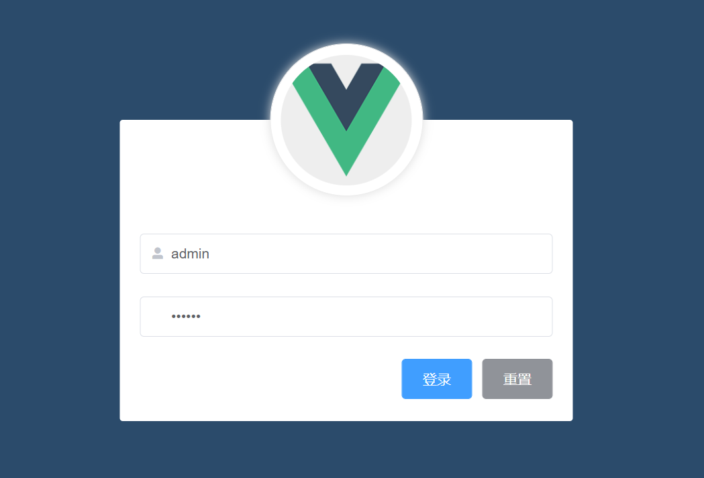
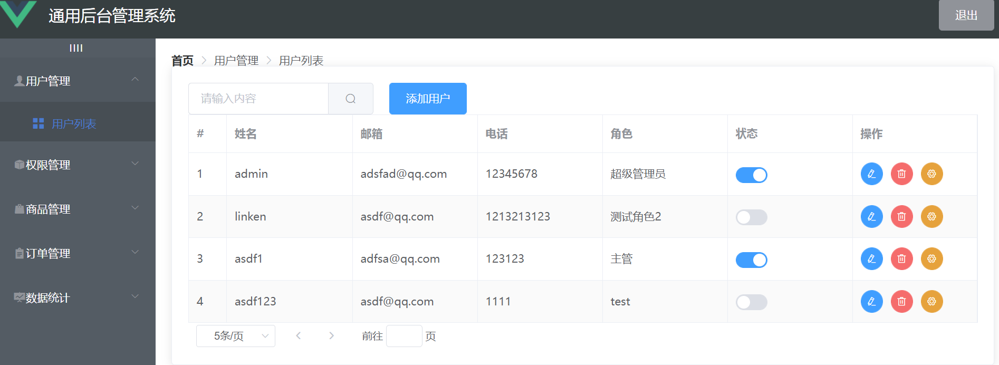
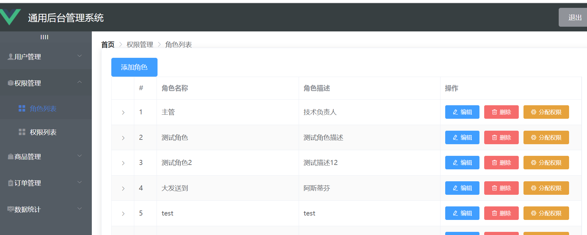
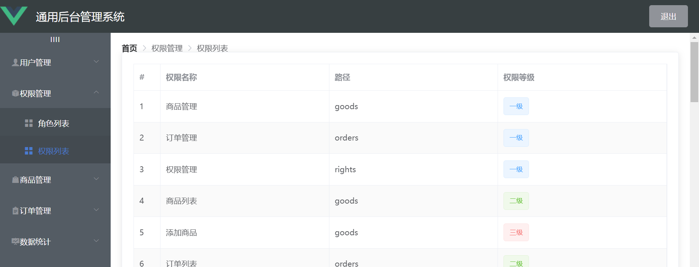
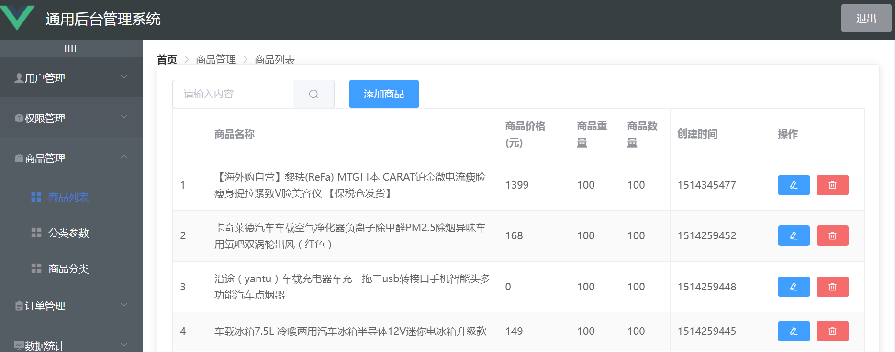
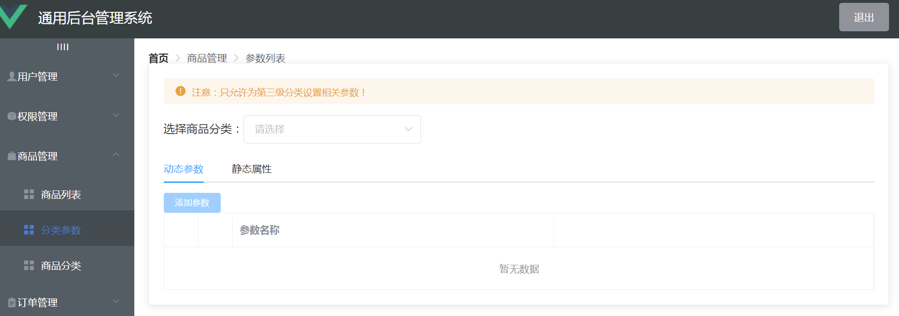
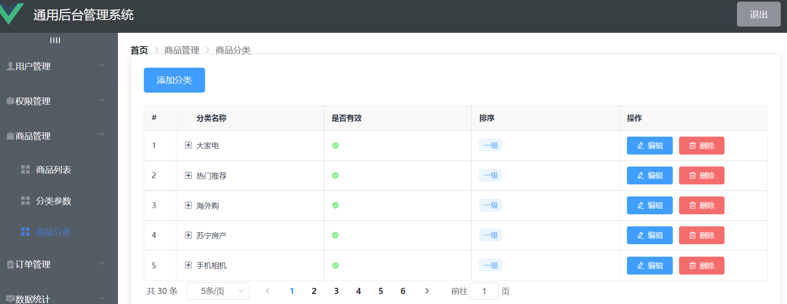
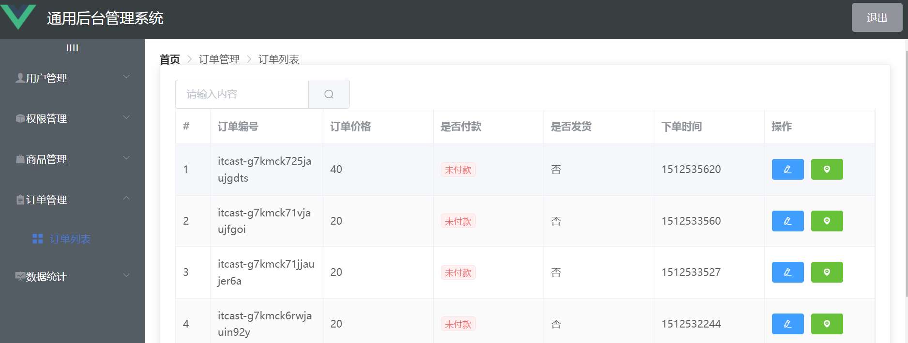
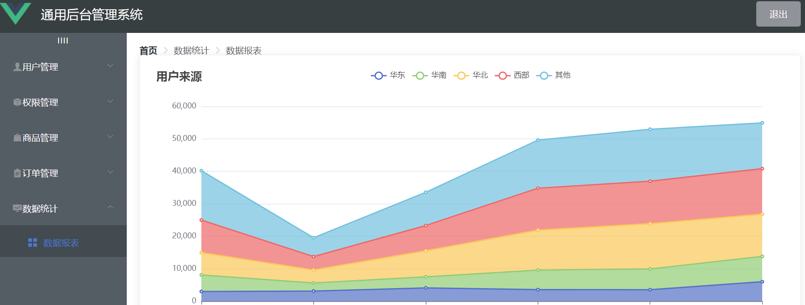

# admin-manage

前台代码：https://github.com/kalipoison/admin-manage

后台代码：https://github.com/kalipoison/admin-manage-server


# 启动项目

 安装依赖 ：npm install
 启动项目 ：npm run serve


# 技术栈

Vue + Vue-router + Element-UI + Axios + Echarts

- axios => 发送请求
- echarts => 图表
- element-ui => element ui组件
- lodash => js工具库,该项目用到深拷贝与对象合并


## 功能：

用户登录：与服务端进行用户密码校验，并将返回的token进行存储在sessionStorage，对axios进行二次封装，使得每次请求带有Authorization

```
// 请求在到达服务器之前，先会调用use中的这个回调函数来添加请求头信息

axios.interceptors.request.use(config => {

 // 为请求头对象，添加token验证的Authorization字段

 config.headers.Authorization = window.sessionStorage.getItem('token');

 // 在最后必须 return config

 return config;

})
```

退出登录：清空sessionStorage中的token信息

```
    logout () {
      // 清空token
      window.sessionStorage.clear()
      // 页面重定向到登录页面
      this.$router.push('/login')
    },
```


权限管理： 通过权限管理模块控制不同的用户可以进行哪些操作,具体可以通过角色的方式进行控制,即每个用户分配一个特定的角色,角色包括不同的功能权限

用户管理： 用户相关信息操作

商品管理： 商品相关信息操作

订单管理： 订单相关信息操作

数据统计： 数据图表显示


# 项目效果展示：


 
















